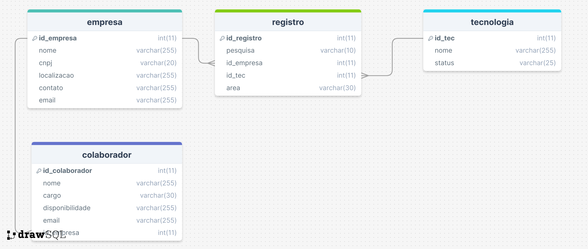

# Sistema RESILIADATA
O **Sistema RESILIADATA** é um banco de dados desenvolvido para armazenar informações críticas utilizadas por empresas parceiras para avaliar tecnologias e gerenciar colaboradores.

## Estrutura do Banco de Dados

O banco de dados consiste nas seguintes entidades:

- `empresa`: Armazena informações sobre as empresas, incluindo nome, CNPJ, localização, contato e email.
- `tecnologia`: Contém detalhes sobre as tecnologias, como nome e status (ativo/inativo).
- `colaborador`: Registra os colaboradores das empresas, seus cargos, disponibilidade e emails.
- `registro`: Mantém um registro das tecnologias utilizadas pelas empresas, associadas a pesquisas específicas.

## Relacionamentos

### Empresa ↔️ Tecnologia
- Relacionamento Muitos-Para-Muitos: Uma Empresa pode utilizar diversas Tecnologias, e uma Tecnologia pode ser empregada por várias Empresas. Isso é gerenciado pela entidade `registro` que atua como uma tabela de junção entre `empresa` e `tecnologia`.
### Colaborador ➡️ Empresa
- Relacionamento Um-Para-Muitos: Uma Empresa Parceira pode ter vários Colaboradores, mas um Colaborador está vinculado a apenas uma Empresa.

## Modelagem do Banco de Dados



## Views do Banco de Dados

As views são utilizadas para simplificar consultas complexas e fornecer uma camada de abstração para operações comuns. Abaixo estão as views criadas neste projeto, juntamente com exemplos de como utilizá-las.

### MaiorNumeroTecnologias
Identifica a empresa que utiliza o maior número de tecnologias na última pesquisa (2/2022).

```sql
CREATE VIEW MaiorNumeroTecnologias AS
SELECT emp.nome AS nome, COUNT(reg.id_registro) AS `Quantidade de tecnologias 2/2022`
FROM empresa as emp
INNER JOIN registro as reg ON emp.id_empresa = reg.id_empresa
WHERE reg.pesquisa = '2022/2'
GROUP BY nome
ORDER BY COUNT(reg.id_registro) DESC;
```

### MenorNumeroTecnologias
Determina a empresa que utilizava o menor número de tecnologias na pesquisa anterior (1/2022).

```sql
CREATE VIEW MenorNumeroTecnologias AS
SELECT emp.nome AS nome, COUNT(reg.id_registro) AS `Quantidade de tecnologias 1/2022`
FROM empresa as emp
LEFT JOIN registro as reg ON emp.id_empresa = reg.id_empresa
WHERE reg.pesquisa = '2022/1'
GROUP BY nome
ORDER BY COUNT(reg.id_registro) ASC;
```

### EmpresasDeDados
Conta quantas empresas utilizam tecnologias na área de “Dados”.

```sql
CREATE VIEW EmpresasDeDados AS
SELECT COUNT(DISTINCT reg.id_empresa) AS `Quantidade de Empresas que usam tecnlogias para dados`
FROM registro AS reg
WHERE reg.area = 'Dados';
```
### EmpresasSemDados
Conta quantas empresas utilizam tecnologias que não são da área de “Dados”.

```sql
CREATE VIEW EmpresasSemDados AS
SELECT COUNT(DISTINCT reg.id_empresa) AS `Quantidade de Empresas que não usam tecnlogias para dados`
FROM registro AS reg
WHERE reg.area != 'Dados';
```
## Como utilizar as Views
Para consultar as informações das views, você pode executar comandos SELECT simples. Aqui esta um exemplo:
```sql
-- Consulta a view MaiorNumeroTecnologias para encontrar a empresa com o maior uso de tecnologias
SELECT * FROM MaiorNumeroTecnologias
LIMIT 1;
```

## Como Executar
1. Importe o modelo de banco de dados e os inserts no arquvivo `schema.sql` para a ferramenta de sua escolha.
2. Execute as migrações para criar as tabelas no banco de dados.
3. Utilize o arquivo `query.sql` para fazer as consultas criadas no banco de dados.
